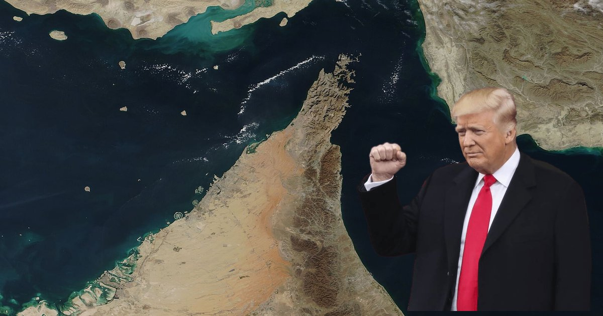
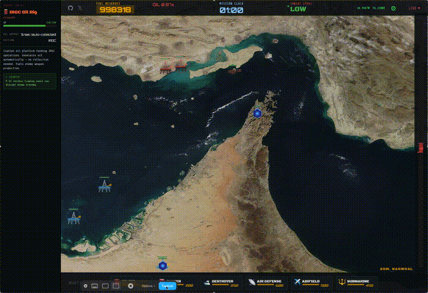

# Strait of Hormuz: Tower Defense

A real-time strategy tower defense game set in the Strait of Hormuz. Command a coalition fleet to escort oil tankers through one of the world's most contested waterways, while an AI-controlled IRGC builds defenses to stop you.

<p align="center">
  <a href="https://strait-of-hormuz-io.pages.dev">
    
    <br/>
    <strong>PLAY NOW</strong>
  </a>
</p>

<p align="center">
  
</p>

Built with [Phaser 3](https://phaser.io/) and deployed on [Cloudflare Pages](https://pages.cloudflare.com/).

## ✨ Features

🛢️ **Oil Economy** — Both sides compete for oil. Build rigs, protect tankers, and manage your fuel reserves. Every unit costs oil, every rig generates it.

⚓ **6 Coalition Units** — Deploy oil rigs, tankers, destroyers, air defense systems, airfields with F-22 strikes, and submarines with sonar detection.

📈 **IRGC AI Escalation** — The AI scales up over time: missile launchers at spawn, mines at 2 min, cruise missiles at 3 min, drone swarms at 3:30, fast boat swarms at 4 min, and mini-submarines at 5 min.

🚤 **Fast Boat Swarms** — Waves of IRGC speedboats (gun boats + suicide boats) attack in coordinated swarms that grow larger as the game progresses.

⚖️ **Tug-of-War Balance Meter** — A pressure gauge that constantly drifts toward IRGC victory. Push tankers through the strait and destroy IRGC assets to swing it back. If it maxes out in either direction, the game ends.

🇺🇸 **Trump Oil Shocks** — Random geopolitical events where Trump appears with a speech bubble, voice clip, and oil price swing between -10% and +10%. Affects your income in real time.

⬆️ **Unit Upgrades** — Click any deployed unit to upgrade hull, damage, fire rate, engine, sonar, and more. Upgrades apply globally to all units of that type.

🎯 **Destroyer Commands** — Click a deployed destroyer, then click the map to send it on a move command. It will navigate to the point and patrol the area.

🔱 **Submarine Warfare** — Coalition subs patrol autonomously with sonar that reveals hidden IRGC mini-subs. IRGC subs surface to fire torpedoes then dive again.

🛰️ **Real Satellite Map** — The game map is the actual Strait of Hormuz satellite image, with build zones defined as coded polygons matching the real geography.

🏆 **Local Leaderboard** — Compete against yourself with a local high-score leaderboard. Track survival time and tankers escorted.

📱 **Mobile Support** — Responsive layout with fullscreen toggle, touch controls, and landscape-only enforcement.

## 🚀 Getting Started

```bash
# Install dependencies
npm install

# Run dev server
npm run dev

# Build for production
npm run build

# Preview production build
npm run preview
```

## 🛠️ Tech Stack

- **Engine:** [Phaser 3](https://phaser.io/) (Canvas renderer)
- **Build:** [Vite](https://vitejs.dev/)
- **Sprites:** Procedurally rendered at boot time (no sprite sheets)
- **Audio:** Web Audio API synth effects + MP3 ambient tracks
- **Deploy:** Cloudflare Pages (static)
- **Tests:** Vitest (unit) + Playwright (E2E smoke)

## 📁 Project Structure

```
src/
  config/       # Game constants, unit stats, zone polygons, asset renderer
  entities/     # Game entities (Ship, Destroyer, OilRig, FastBoat, Mine, etc.)
  scenes/       # Phaser scenes (Boot, Game, GameOver)
  systems/      # AI controller, combat, economy, balance meter, Trump shocks
  ui/           # HUD, deployment bar, upgrade panel, settings modal
  utils/        # Pure calculation functions, targeting utility, texture helpers
tests/
  unit/         # Vitest unit tests for calculations, economy, balance
  e2e/          # Playwright smoke test
```

## 🥚 Easter Eggs

The game has a few hidden codes you can type during gameplay:

| Code | Effect |
|------|--------|
| `TRUMP` | Triggers an immediate Trump oil shock event |
| `iloveoil` | Sets your oil reserves to 999,999 |
| `unlockall` | Instantly unlocks all advanced units |
| `alloutwar` | Total military mobilization — spawns the entire arsenal for both sides and triggers a Trump war speech |

## 📄 License

[MIT](LICENSE)
